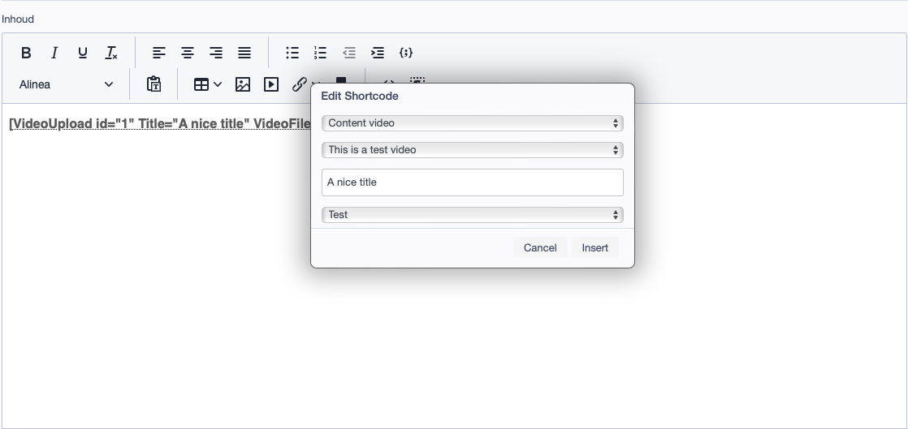
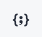
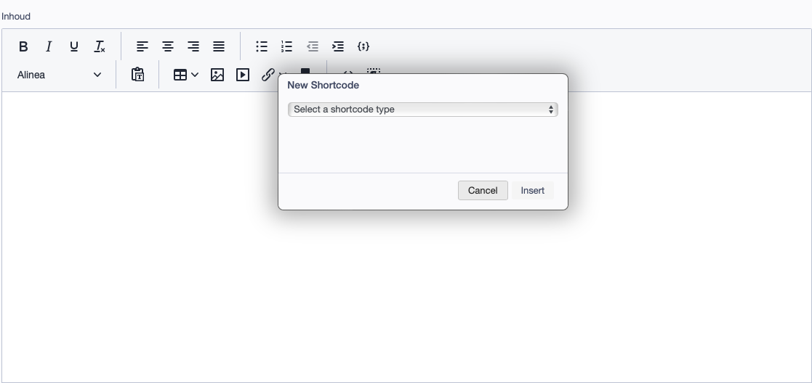
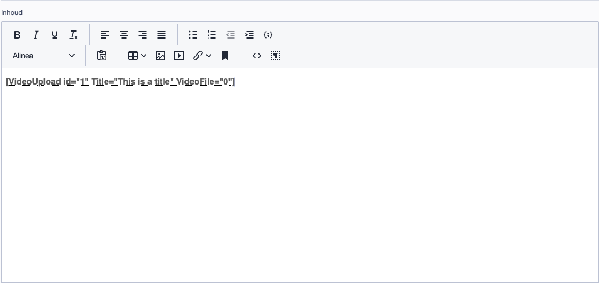
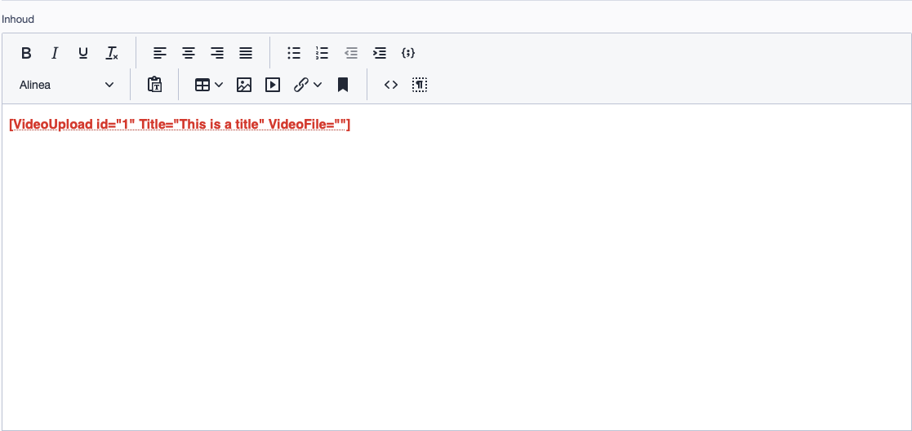

# SilverStripe Shortcodable



Provides a popup for inserting and editing shortcodes in the SilverStripe CMS. Shortcodes are small pieces of code inside square brackets that trigger a larger function. This module allows you to define your own `DataObjects` and `ViewableData` as shortcodes, and insert them into the HTMLEditorField in the CMS.

## Requirements
-   SilverStripe ^5
-   PHP ^8.1

> **Note:** This module may work with SilverStripe 4 and PHP 7.4, but it is not officially supported. Please use [sheadawson/silverstripe-shortcodable](https://github.com/sheadawson/silverstripe-shortcodable) for SilverStripe 4 and below.

## Installation

Install the module using composer.

```bash
composer require violet88/silverstripe-shortcodable
```

## Configuration

### Defining Shortcodes

Define your shortcodes in a yml config file. You can define shortcodes for `DataObjects` and `ViewableData` classes.

```yaml
Violet88\Shortcodable\Shortcodable:
  shortcodable_classes:
    - MyDataObject
    - MyViewableData
```

Shortcodable classes may be namespaced, but at the moment using duplicate class names in different namespaces is not supported and may lead to unexpected results. This is a known issue and will be addressed in a future release.

### Parsing Shortcodes

In order to be able to parse the shortcodes, the `parse_shortcode` method must be available in the class. This method should return the HTML that will replace the shortcode in the frontend.

```php
use SilverStripe\ORM\DataObject;
use SilverStripe\View\ArrayData;

class MyDataObject extends DataObject
{
    private static array $db = [
        'Title' => 'Varchar',
        'Content' => 'HTMLText',
    ];

    public static function parse_shortcode($arguments, $content, $parser, $tagName)
    {
        $object = self::get()->byID($arguments['id']);

        return ArrayData::create([
            'Title' => $object->Title,
            'Content' => $object->Content,
        ])->renderWith('MyDataObject');
    }
}
```

> **Note:** The `parse_shortcode` method doesn't need to use template rendering. It can return any string.

> **Note:** The `parse_shortcode` method must be a static one. All shortcodes contain an 'id' argument with which the object can be fetched.

### Additional Shortcode Attributes

You can define additional attributes for your shortcodes using the `shortcode_fields` config array. These attributes will be available in the shortcode popup when inserting or editing a shortcode.

In this array you can also define how the attribute should be rendered in the popup. All standard HTML input types are supported, as well as a `select` and `radiogroup` type.

The schema for the `shortcode_fields` array is as follows:

```json
{
    "attribute_name": {
        "type": "text",
        "label": "Attribute label", // Optional
        "placeholder": "Attribute placeholder", // Optional
        "options": { // Only for select and radiogroup types
            "option1": "Option 1",
            "option2": "Option 2"
        }
    }
}
```

This schema can translate to the following `shortcode_fields` array in PHP:

```php
use SilverStripe\ORM\DataObject;
use SilverStripe\View\ArrayData;

class MyDataObject extends DataObject
{
    private static array $db = [
        'Title' => 'Varchar',
        'Content' => 'HTMLText',
    ];

	private static $shortcode_fields = [
		'Title' => [
			'type' => 'text',
            'label' => 'Title for video',
			'placeholder' => 'Enter a title'
		],
        'Content' => [
            'type' => 'textarea',
            'placeholder' => 'Description for video'
        ],
        'Type' => [
            'type' => 'select',
            'options' => [
                'youtube' => 'YouTube',
                'vimeo' => 'Vimeo'
            ]
        ]
	];

    public static function parse_shortcode($arguments, $content, $parser, $tagName)
    {
        $object = self::get()->byID($arguments['id']);

        return ArrayData::create([
            'Title' => $object->Title,
            'Content' => $object->Content,
        ])->renderWith('MyDataObject');
    }
}
```

> **Note:** Since the `shortcode_fields` attribute is static and cannot be changed, we've added the ability to define the options for a `select` or `radiogroup` type using a method. This method should return an array of options.
> ```php
> private static $shortcode_fields = [
>     'Type' => [
>         'type' => 'select',
>         'options' => 'getTypes'
>     ]
> ];
>
> public function getTypes()
> {
>     return [
>        'youtube' => 'YouTube',
>        'vimeo' => 'Vimeo'
>     ];
> }
> ```

If you're looking for something easier to set up, an array of field names can be used instead of the full schema. This will default to a `text` input type with the field name as the placeholder.

```php
use SilverStripe\ORM\DataObject;
use SilverStripe\View\ArrayData;

class MyDataObject extends DataObject
{
    private static array $db = [
        'Title' => 'Varchar',
        'Content' => 'HTMLText',
    ];

    private static $shortcode_fields = [
        'Title',
        'Content',
        'Type'
    ];

    public static function parse_shortcode($arguments, $content, $parser, $tagName)
    {
        $object = self::get()->byID($arguments['id']);

        return ArrayData::create([
            'Title' => $object->Title,
            'Content' => $object->Content,
        ])->renderWith('MyDataObject');
    }
}
```

## CMS Usage
Once installed a new icon will appear in the CMS editor toolbar. It looks like this:


This button shows a popup that can be used to create a new shortcode:



Shortcodes can also be edited by clicking on them in the editor:


### Validity

Shortcodes are only valid if they are in the format `[shortcode]` or `[shortcode attribute="value"]`. If the shortcode is not valid, it will be highlighted in red and removed when the editor is saved:

| Valid Shortcode | Invalid Shortcode |
| --- | --- |
| [](docs/img/valid.png) | [](docs/img/invalid.png) |

## Upgrading from [sheadawson/silverstripe-shortcodable](https://github.com/sheadawson/silverstripe-shortcodable)

If you are upgrading from [sheadawson/silverstripe-shortcodable](https://github.com/sheadawson/silverstripe-shortcodable) the following steps can be used to get you back on track:

1.  Remove the old module using composer:
    ```bash
    composer remove sheadawson/silverstripe-shortcodable
    ```

2.  Install the new module using composer:
    ```bash
    composer require violet88/silverstripe-shortcodable
    ```

3.  Update your config namespaces from `Silverstripe\Shortcodable` to `Violet88\Shortcodable`:
    ```diff
    - Silverstripe\Shortcodable:
    + Violet88\Shortcodable\Shortcodable:
      shortcodable_classes:
        - MyDataObject
        - MyViewableData
    ```

4.  Update your class namespaces from `Shortcodable` to `Shortcodable`:
    ```diff
    - use SilverStripe\Shortcodable;
    + use Violet88\Shortcodable\Shortcodable;

    - use SilverStripe\Shortcodable\Controller\ShortcodableController;
    + use Violet88\Shortcodable\Controllers\ShortcodableController;
    ```

5.  Remove references to the `ShortcodableHtmlEditorField` and `ShortcodableShortcodeParserExtension` extensions. These no longer exist in the new module.

6.  Update your `getShortcodeFields` method to use the new `shortcode_fields` config array. This array can be used to define additional attributes for your shortcodes.
    ```diff
    - public function getShortcodeFields() {
    -     return FieldList::create([
    -         TextField::create('Title', 'Title for video'),
    -         TextareaField::create('Content', 'Description for video'),
    -         DropdownField::create('Type', 'Type', [
    -             'youtube' => 'YouTube',
    -             'vimeo' => 'Vimeo'
    -         ])
    -     ]);
    - }
    + private static $shortcode_fields = [
    +     'Title' => [
    +         'type' => 'text',
    +         'placeholder' => 'Title for video'
    +     ],
    +     'Content' => [
    +         'type' => 'textarea',
    +         'placeholder' => 'Description for video'
    +     ],
    +     'Type' => [
    +         'type' => 'select',
    +         'options' => [
    +             'youtube' => 'YouTube',
    +             'vimeo' => 'Vimeo'
    +         ]
    +     ]
    + ]
